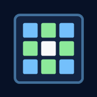

# Foto-Collage (PWA)

Language: English | [Deutsche Version](./README.de.md)



A progressive web app to build collages directly in the browser:

- Home screen with mode selection: `Photo Collage` or `Shape Collage`
- Choose a template (for example 2x2, 3x3, hero layouts, hex layouts)
- Optional assistant for automatic template suggestions
- Load photos
- Fine-tune crop and zoom per slot
- Reorder photos in fine-tune mode
- Add and move text per slot
- Add watermark on export
- Export as PNG, JPEG, PDF, or GIF
- Shape Collage mode with word/SVG mask, subtitle, and export

The app runs fully client-side and does not require a backend.
Photos stay on the device.

Repository: [https://github.com/marsrakete/fotocollage](https://github.com/marsrakete/fotocollage)

## Quickstart in 30 seconds

### For end users

1. Open: [https://marsrakete.github.io/fotocollage/](https://marsrakete.github.io/fotocollage/)
2. On the home screen choose `Photo Collage` or `Shape Collage`
3. Photo mode flow: `Choose template -> Load photos -> Fine-tune -> Export` (optional with assistant)
4. Shape mode flow: `Step A Size -> Step B Stencil/Word -> Step C Photos, subtitle, export`
5. Optional: install as PWA (browser menu: Install app / Add to Home Screen)

### For local development

1. In PowerShell from project directory: `.\start-server.ps1`
2. Open in browser: `http://localhost:5000/`
3. Preset Builder (visual): `http://localhost:5000/preset-builder.html`

## PWA installation

### For normal users (recommended)

1. Open the app in browser:

[https://marsrakete.github.io/fotocollage/](https://marsrakete.github.io/fotocollage/)

2. Install as app:
- Edge/Chrome Desktop: address bar -> install app
- Android (Chrome/Edge): menu -> install app / add to home screen
- iOS (Safari): share -> add to home screen

### For nerds (local via localhost)

1. Start local server:

```powershell
.\start-server.ps1
```

2. Open app in browser:

`http://localhost:5000/`

Optional different port:

```powershell
.\start-server.ps1 -Port 5050
```

Optional:

- Preset Builder (visual): `http://localhost:5000/preset-builder.html`

## Features

- 4-step workflow for fast photo collage creation
- Separate Shape Collage workflow (A to C) with word/SVG masks
- Many presets including asymmetric layouts and free-unit presets
- Layout modes: `Grid` and `Hex-Pack` (compact hex layout)
- Per-slot shapes: `rect`, `rounded-rect`, `circle`, `diamond`, `hexagon`
- Safe-area support for social presets
- Multilingual UI (`de`, `en`, `fr` with fallback behavior)
- Offline support via service worker
- Version/update check at startup and manually from settings

## Step-by-step (1 to 4)

### Step 1: Choose template

- Choose a preset from available template cards
- Configure spacing and outer margin
- Set collage background color
- Open assistant or start over if needed

### Step 2: Load photos

- Select photos from device
- Slots can stay empty intentionally
- Continue even when not all slots are filled

### Step 3: Fine-tune

- Select active slot in preview
- Move and zoom image directly in preview
- Adjust text per slot and place text by drag
- Optional sort mode for slot content swapping

### Step 4: Export

- Select export format: PNG, JPEG, PDF, GIF
- Select export preset or free size
- Share on mobile where supported, save on desktop
- Watermark and EXIF options are applied if enabled

## Shape Collage (A to C)

- Separate mode focused on stencil-based output
- Step A: target size/preset
- Step B: choose `Word` or SVG motif stencil
- Step C: load/reorder photos, subtitle, export
- Word mode supports font, size, spacing, bold/italic
- SVG mode supports visual motif selection and scaling

## Export formats

- PNG: lossless image
- JPEG: compressed image, smaller file size
- PDF: print/share friendly wrapper around raster output
- GIF: animated sequence mode with frame delay

## Layout and slot formats

- Standard grids (for example 2x2, 3x3, 1x4, 4x1 variants)
- Hero/asymmetric presets (combined slots)
- Circle/diamond/hexagon slot variants
- Hex-pack layouts for compact non-rectangular compositions

## Export presets

- Free (default)
- Social presets (for example Instagram, LinkedIn, Open Graph 1200x630)
- Safe-area hints for applicable social presets

## Project structure

- `index.html` - app shell
- `styles.css` - UI styling
- `app.js` - application logic
- `service-worker.js` - offline caching/update pipeline
- `config/templates.config.js` - template presets
- `config/export.config.js` - export presets and ranges
- `config/i18n.config.js` - localized UI strings
- `config/tips.config.js` - localized daily tips
- `config/stencils.config.js` + `config/stencils/*.svg` - shape collage stencil set
- `preset-builder.html` - visual helper for template work

## Programmer notes: preset configuration

### Preset Builder (visual)

The Preset Builder provides a visual way to build/edit slot templates and output JSON that can be copied into template config.

### What `createGridSlots(rows, cols)` does

It generates a slot list for a regular matrix.  
Each slot receives `x`, `y`, `w`, and `h` based on row/column geometry.

### Preset localization

Template labels are localized in config (`de`, `en`, `fr`) and rendered according to active UI language.

### Free-unit presets

Additional presets support unit-focused aspect ratios and special social/media outputs.

## Update and versioning logic

- App version metadata lives in:
  - `app.js` (`DEFAULT_VERSION_INFO`)
  - `version.json`
  - `service-worker.js` (`CACHE_VERSION`)
- On startup the app checks server version and can propose update
- Settings contain a manual `Check for updates` action

## Why at least one server run is required

PWA features (service worker, caching, installability) require `http(s)` origin rules.
So opening via plain `file://` is not enough for full functionality.

## GitHub publishing

Recommended public URL:  
[https://marsrakete.github.io/fotocollage/](https://marsrakete.github.io/fotocollage/)

## License

Apache 2.0. See [LICENSE](./LICENSE).

## Author and contact

- Author: Marsrakete / Millux
- Contact: [millux@marsrakete.de](mailto:millux@marsrakete.de)
